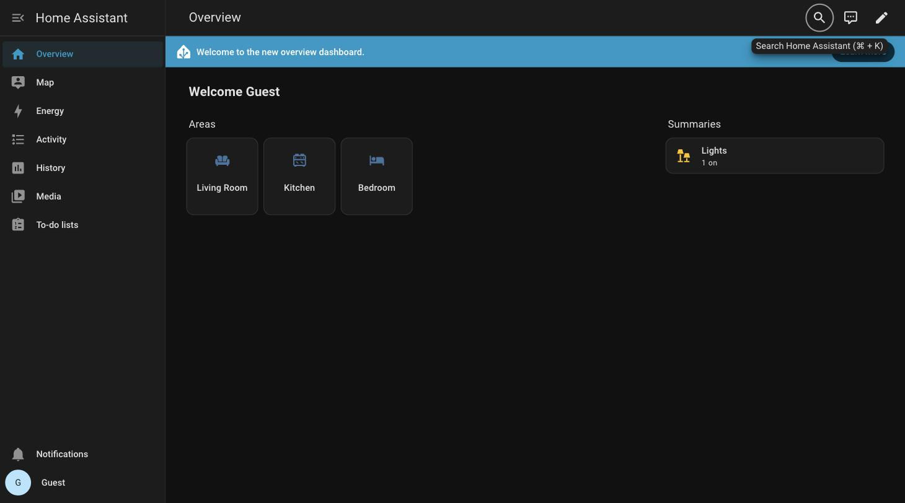

<h1 align="center">Access Control for Home Assistant</h1>

<p align="center">
  <strong>Give everyone in the house their own Home Assistant.</strong><br>
  Guests see the lights. Kids get their own dashboard. Nobody but you
  touches the locks, the add-ons, or the settings.
</p>

<p align="center">
  
  <a href="https://github.com/hacs/integration"></a>
  
  
  
  
</p>

<p align="center">
  
</p>

<p align="center"><em>A guest's dashboard. Their lights are there. The front door lock isn't.</em></p>

---

> [!CAUTION]
> **This is an alpha.** It works, it's tested, and it survived a round of
> deliberately trying to break it. But it's new, and it hasn't lived in real
> houses yet. **Don't make it the only thing between someone and your front
> door yet.** Try it, break it, and
> [tell me what happened](https://github.com/FezVrasta/ha-rbac/issues).

---

## The problem

Home Assistant has two kinds of user: **administrator**, and **everyone else**.

That's the whole model. "Everyone else" still sees every device in your home:
every camera, every lock, every sensor. There's no way to hand a house guest a
dashboard with just the living room lights on it, or to give your kid a tablet
that can't unlock the front door.

## What you can control

### 🏠 Entities: what they see and touch

**No access**, **read**, or **read and control**, as a baseline plus exceptions.
Target them however you already think about your house:

| | |
| --- | --- |
| **Areas** | "nothing in the bedroom" |
| **Domains** | "no locks, no cameras" |
| **Labels** | "only what I tagged `shared`" |
| **Floors** | "the ground floor only" |
| **Entities / devices** | one specific thing |

Chosen with the same pickers you use everywhere else in Home Assistant.

### 📍 Details: how much of an entity they see

An entity someone can see, they normally see in full: every attribute it
reports. Often that's more than you meant to share:

| | |
| --- | --- |
| **Where someone is** | `latitude`, `longitude` on people and trackers |
| **Access codes** | the code attribute a lock or alarm exposes |
| **Network details** | IP addresses, MAC addresses, hostnames |
| **Identifiers** | serial numbers, device IDs, account names |
| **Noise** | diagnostics and internals nobody needs to read |

Rules name both the attributes and the entities they apply to, so hiding
`latitude` on people and trackers leaves the zones that define where home is
working normally.

Hidden attributes are gone from the dashboard, the state API, history, live
updates, and templates.

### 📱 Apps, dashboards and add-ons: where they can go

Everything in the sidebar, ticked or unticked:

| | |
| --- | --- |
| **Dashboards** | give the kids their own and hide yours |
| **Add-ons** | no File Editor, no Terminal, no Node-RED |
| **Built-in screens** | Energy, History, Logbook, Map, Media, To-do |
| **Custom panels** | anything else that shows up there |

Home Assistant treats all of these as the same kind of thing, so this does too:
one list, read from your instance, whatever you happen to have installed.

### ⚙️ Commands: what they can change

**Ordinary use**, or **everything including settings**. Which half is which is
read from Home Assistant's own markings rather than a list kept here, so it
stays right as Home Assistant grows.

---

And the parts that make it usable:

🙈 **Hidden means hidden.** A restricted entity isn't greyed out. It isn't in
the dashboard, the search, the history, or the API. As far as that person's Home
Assistant is concerned, it doesn't exist.

🖱️ **No YAML.** All of the above is done in a normal Home Assistant panel.

🏠 **Your setup is untouched.** No core files patched, no automations rewritten,
no entities renamed. Uninstall and everything is exactly as it was.

📋 **A log of every refusal**, so when someone says "it stopped working" you can
see what and why.

## Take a look

<table>
<tr>
<td width="50%">

<p align="center"><em>A guest searching for "lock". There's nothing to find.</em></p>
</td>
<td width="50%">

<p align="center"><em>Same house, same address, signed in as yourself.</em></p>
</td>
</tr>
<tr>
<td width="50%">

<p align="center"><em>"Read everything, except the locks. And don't show me where anyone is."</em></p>
</td>
<td width="50%">

<p align="center"><em>When someone says "it stopped working", look here first.</em></p>
</td>
</tr>
</table>

## How it works, in one minute

It sits in front of Home Assistant and reads everything going past. When your
guest's browser asks for the state of the house, it answers, minus the parts
they're not allowed to see. When it asks to unlock a door, it says no.

The useful part is that it ships no list of what's dangerous. Home Assistant
already marks its own administrative features, and this reads those markings
live, on your instance, with your integrations installed. That's why it doesn't
need updating every time Home Assistant does.

Longer version in [docs/DESIGN.md](docs/DESIGN.md).

## Install

### 1. Add the integration

**With HACS:**

<a href="https://my.home-assistant.io/redirect/hacs_repository/?owner=FezVrasta&repository=ha-rbac&category=integration"></a>

That button adds this as a custom repository in your own Home Assistant. Then
**Download**, and restart. By hand instead: HACS → ⋮ → *Custom repositories* →
paste `https://github.com/FezVrasta/ha-rbac`, category **Integration**.

**Without HACS:** copy `custom_components/ha_rbac` into your
`config/custom_components` and restart.

Then add **Access Control** from Settings → Devices & Services.

> [!NOTE]
> Nothing changes until you give someone a role, so it's safe to install and
> look around first.

### 2. Close Home Assistant's own door

> [!IMPORTANT]
> **This step is the one that matters.** This works by standing in front of
> Home Assistant, so Home Assistant has to stop answering directly. Otherwise
> anyone can walk straight around it with the login they already have. It warns
> you at startup if you skip it.

What you want is Home Assistant listening on `127.0.0.1:8124`, and this
integration (which defaults to exactly that) answering on `8123`, the address
everyone already uses. Nothing else changes: bookmarks, the companion app, your
Google or Alexa setup all keep working, and **nobody gets signed out**, because
to a browser it is the same address as before. In Docker, keep publishing `8123`
and don't publish `8124`.

> [!WARNING]
> **Don't reach for `configuration.yaml`.** Recent Home Assistant versions moved
> the `http` settings into their own store, and YAML is ignored from the first
> start onwards. It changes nothing and raises a repair issue saying so.

The awkward part is that Home Assistant is mid-migration here: the setting has
left YAML, and as of 2026.8 the Settings → System → Network page doesn't offer
it yet. Until it does, set it over the websocket API:

<details>
<summary><strong>Setting it today (copy-paste)</strong></summary>

<br>

Make a long-lived access token from your profile page, then:

```python
# pip install aiohttp
import asyncio, aiohttp

URL   = "http://homeassistant.local:8123"   # where Home Assistant is now
TOKEN = "paste-your-long-lived-token"

async def main():
    async with aiohttp.ClientSession() as s:
        ws = await s.ws_connect(f"{URL}/api/websocket")
        await ws.receive_json()
        await ws.send_json({"type": "auth", "access_token": TOKEN})
        await ws.receive_json()
        await ws.send_json({"id": 1, "type": "http/config/configure", "config": {
            "server_host": ["127.0.0.1"], "server_port": 8124}})
        print(await ws.receive_json())

asyncio.run(main())
```

Home Assistant restarts and comes back on `127.0.0.1:8124`, with this
integration answering on `8123`. The change is staged as a **trial** and reverts
itself if it locks you out, so once you have checked you can still sign in,
confirm it by sending `{"id": 2, "type": "http/config/promote"}` the same way,
through the proxy this time, since that is the only door left.

Send the whole config, not just the host: omitted keys fall back to their
defaults rather than keeping your current values.

</details>

> [!CAUTION]
> **If this integration ever fails to load, Home Assistant is reachable only
> from its own machine.** That's deliberate: it fails closed rather than
> throwing the doors open. But keep a way in,
> `ssh -L 8124:127.0.0.1:8124 your-ha-host` and then browse `localhost:8124`,
> and set that up before you need it.

<details>
<summary><strong>What this protects against, honestly</strong></summary>

<br>

**It holds** against anyone on your network. Someone with a guest login cannot
see or touch what their role forbids, from a browser, the app, or the API.

**It doesn't hold** against someone with a login *on the machine Home Assistant
runs on*. Anyone with a shell there can read Home Assistant's credential store
and impersonate you, which beats Home Assistant's own security, not just this.
If that's a person in your house, don't give them a shell account.

**On Home Assistant OS and Supervised**, add-ons talk to Home Assistant through
a private channel nothing can sit in front of, so an add-on with API access can
do as it likes regardless of anyone's role. The loopback setting above is fine
here, though: Supervisor reaches Home Assistant over a Unix socket rather than
the network port.

Full detail in [docs/DESIGN.md](docs/DESIGN.md).

</details>

## Your first role

1. Open **Access Control** in the sidebar.
2. **Clone** *Read only*, name it something like *Guest*, and add the areas or
   domains to hide as exceptions. Untick any apps, dashboards or add-ons they
   shouldn't reach.
3. Go to **Users**, pick the person, choose the role, save.

<p align="center">
  
</p>

Have them reload, and their Home Assistant is now smaller.

Anyone without a role keeps exactly the access Home Assistant already gave them,
so you can roll this out one person at a time.

**Locked yourself out?** You can't lock out the owner account: that's built in
and can't be changed from the panel. Failing that, use the SSH tunnel from the
install step for plain, unfiltered Home Assistant.

## What it can't do yet

- **Automations aren't affected.** They run as the system, not as a person, so
  an automation can still touch anything. Same as stock Home Assistant.
- **Hiding something hides it well, but doesn't rewrite history.** A denied
  dashboard is gone from the sidebar and its config is refused; a denied add-on
  leaves the sidebar, its Supervisor endpoints are refused, it's dropped from
  the add-on listings, and its own web page is refused even to someone who
  knows its address. What none of it does is pretend the thing was never
  installed. Someone determined can still tell something is being withheld.

## Contributing

Bug reports from real households are the most useful thing right now,
especially "my dashboard broke, and here's what the Denials tab said". Issues
and pull requests welcome; see [CONTRIBUTING.md](CONTRIBUTING.md) for how to run
the tests.

## Licence

MIT.
