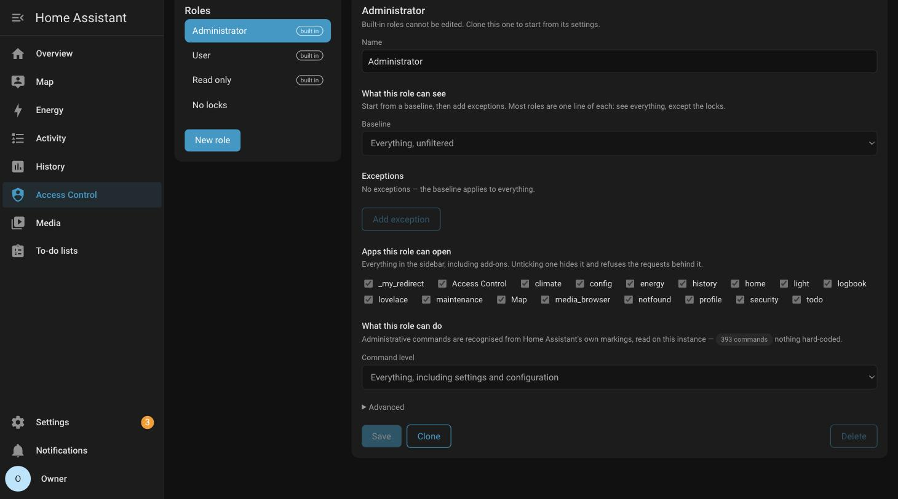
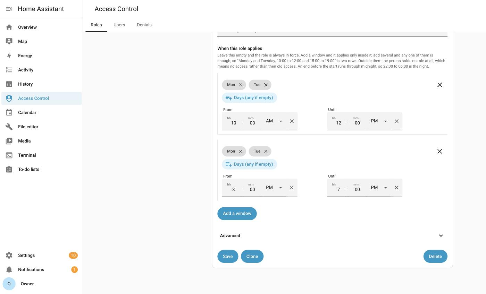
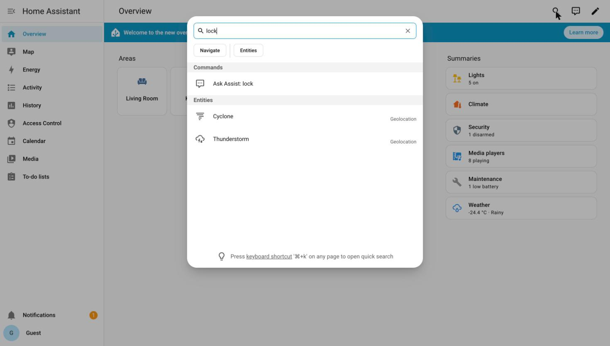
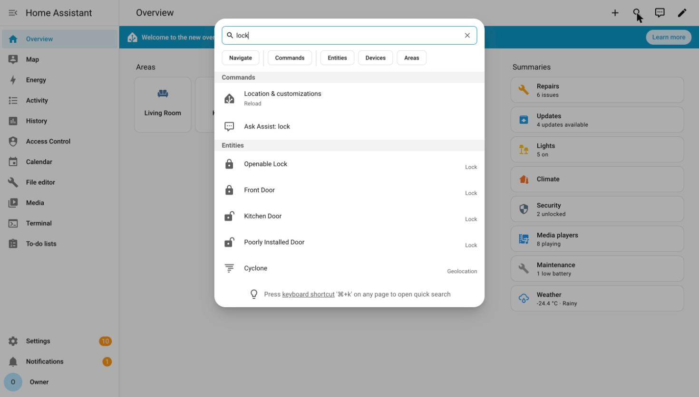
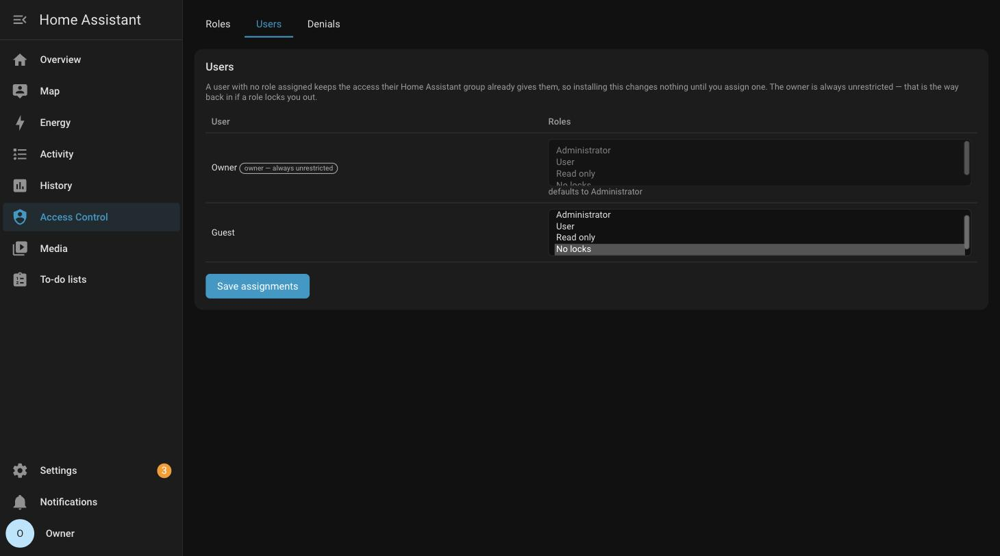
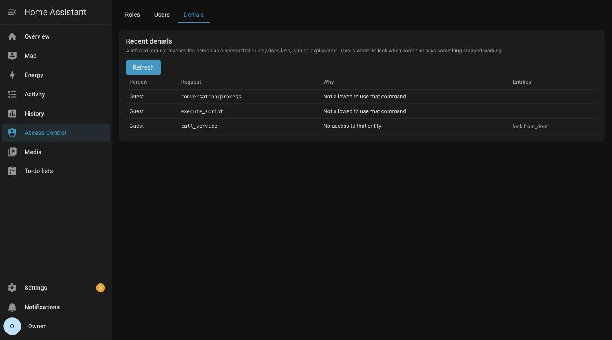

<h1 align="center">Access Control for Home Assistant</h1>

<p align="center">
  <strong>Give everyone in the house their own Home Assistant.</strong><br>
  Guests see the lights. Kids get their own dashboard. Nobody but you
  touches the locks, the add-ons, or the settings.
</p>

<p align="center">
  
  <a href="https://github.com/hacs/integration"></a>
  
  
  
  
</p>

<p align="center">
  
</p>

<p align="center"><em>One role, read out loud: see and control everything, except the locks and cameras, and don't show anyone where people are.</em></p>

---

> [!CAUTION]
> **This is an alpha.** It works, it's tested, and it survived a round of
> deliberately trying to break it. But it's new, and it hasn't lived in real
> houses yet. **Don't make it the only thing between someone and your front
> door yet.** Try it, break it, and
> [tell me what happened](https://github.com/FezVrasta/ha-rbac/issues).

---

## The problem

Home Assistant has two kinds of user: **administrator**, and **everyone else**.

That's the whole model. "Everyone else" still sees every device in your home:
every camera, every lock, every sensor. There's no way to hand a house guest a
dashboard with just the living room lights on it, or to give your kid a tablet
that can't unlock the front door.

## What you can control

### 🏠 Entities: what they see and touch

**No access**, **read**, or **read and control**, as a baseline plus exceptions.
Target them however you already think about your house:

| | |
| --- | --- |
| **Areas** | "nothing in the bedroom" |
| **Domains** | "no locks, no cameras" |
| **Labels** | "only what I tagged `shared`" |
| **Floors** | "the ground floor only" |
| **Entities / devices** | one specific thing |

Chosen with the same pickers you use everywhere else in Home Assistant.

Or let a dashboard say it for you. Each dashboard gets three levels, and a role
holding one at **sees what is on it** or **can control it** gets whatever that
dashboard shows, without naming a single entity:

| | |
| --- | --- |
| **Can open** | the screen loads, showing only what the role is allowed elsewhere |
| **Sees what is on it** | plus reading every entity on that dashboard |
| **Can control it** | plus operating them |

This is worked out when a request is judged, not when the role is saved, so
adding a card to a dashboard extends its holders straight away and removing one
takes it back. It reads the dashboards themselves, so a card type nobody has
heard of counts the same as a built-in one. A denial elsewhere still wins, so
putting a forbidden entity on a dashboard does not unlock it.

### 📍 Details: how much of an entity they see

An entity someone can see, they normally see in full: every attribute it
reports. Often that's more than you meant to share:

| | |
| --- | --- |
| **Where someone is** | `latitude`, `longitude` on people and trackers |
| **Access codes** | the code attribute a lock or alarm exposes |
| **Network details** | IP addresses, MAC addresses, hostnames |
| **Identifiers** | serial numbers, device IDs, account names |
| **Noise** | diagnostics and internals nobody needs to read |

Rules name both the attributes and the entities they apply to, so hiding
`latitude` on people and trackers leaves the zones that define where home is
working normally.

Hidden attributes are gone from the dashboard, the state API, history, live
updates, and templates.

### 📱 Apps, dashboards and add-ons: where they can go

Everything in the sidebar, ticked or unticked:

| | |
| --- | --- |
| **Dashboards** | give the kids their own and hide yours |
| **Add-ons** | no File Editor, no Terminal, no Node-RED |
| **Built-in screens** | Energy, History, Logbook, Map, Media, To-do |
| **Custom panels** | anything else that shows up there |

Home Assistant treats all of these as the same kind of thing, so this does too:
one list, read from your instance, whatever you happen to have installed.

### 🕗 Hours: when the role applies at all

Give a role a window of days, hours, or both, and it only applies inside it.
Add as many windows as the arrangement needs; any one of them is enough:

| | |
| --- | --- |
| **A cleaner** | weekdays, 09:00 to 17:00 |
| **Someone with a split shift** | Monday and Tuesday, 10:00 to 12:00, and again 15:00 to 19:00 |
| **A babysitter** | Friday and Saturday, 18:00 to 23:00 |
| **Weekends on different hours** | weekdays 09:00 to 17:00, weekends 10:00 to 22:00 |
| **A night guest** | every day, 22:00 to 06:00 |

Outside them the role is simply not held, and holding no role means no access
rather than the access they had before. An end before the start runs through
midnight, and the window belongs to the day it opened, so Friday 22:00 to 02:00
is still in force at one on Saturday morning.

It takes effect on connections that are already open, so someone does not keep
what they had until they close the tab.

<p align="center">
  
</p>

### ⚙️ Commands: what they can change

**Ordinary use**, or **everything including settings**. Which half is which is
read from Home Assistant's own markings rather than a list kept here, so it
stays right as Home Assistant grows.

Between those two, hand over one part of the settings without the rest:

| | |
| --- | --- |
| **Automations** | build and debug automations, blueprints and traces |
| **Scripts**, **Scenes** | write them, and reach nothing else |
| **Dashboards** | create and edit them for everyone |
| **Helpers** | counters, timers, schedules, tags |
| **Areas, floors and labels** | rearrange how the house is organised |
| **Devices and integrations** | add and configure the hardware |
| **Users** | create people and change their passwords |
| **Backups** | make them, download them, restore them |

> [!NOTE]
> Automations, scripts and scenes run with no user context, exactly as they do
> in stock Home Assistant. Someone who can write one can make it do anything,
> whatever their role allows directly. Those three record that you trust
> someone rather than containing them.

Four roles come ready to use — **Administrator**, **Editor**, **User** and
**Read only** — and any of them can be cloned and changed. Editor is the one
most people are after: everything a User can do, plus building automations,
scripts, scenes, dashboards and helpers, and nothing that reaches users, backups
or integrations.

---

And the parts that make it usable:

🙈 **Hidden means hidden.** A restricted entity isn't greyed out. It isn't in
the dashboard, the search, the history, or the API. As far as that person's Home
Assistant is concerned, it doesn't exist.

🖱️ **No YAML.** All of the above is done in a normal Home Assistant panel.

🏠 **Your setup is untouched.** No core files patched, no automations rewritten,
no entities renamed. Uninstall and everything is exactly as it was.

📋 **A log of every refusal**, so when someone says "it stopped working" you can
see what and why.

## Take a look

<table>
<tr>
<td width="50%">

<p align="center"><em>A guest searching for "lock". There's nothing to find.</em></p>
</td>
<td width="50%">

<p align="center"><em>The same search, same house, signed in as yourself.</em></p>
</td>
</tr>
<tr>
<td width="50%">

<p align="center"><em>Who gets what. Leave someone unassigned and nothing changes for them.</em></p>
</td>
<td width="50%">

<p align="center"><em>When someone says "it stopped working", look here first.</em></p>
</td>
</tr>
</table>

## How it works, in one minute

It sits in front of Home Assistant and reads everything going past. When your
guest's browser asks for the state of the house, it answers, minus the parts
they're not allowed to see. When it asks to unlock a door, it says no.

The useful part is that it ships no list of what's dangerous. Home Assistant
already marks its own administrative features, and this reads those markings
live, on your instance, with your integrations installed. That's why it doesn't
need updating every time Home Assistant does.

Longer version in [docs/DESIGN.md](docs/DESIGN.md).

## Install

**With HACS:**

<a href="https://my.home-assistant.io/redirect/hacs_repository/?owner=FezVrasta&repository=ha-rbac&category=integration"></a>

That button adds this as a custom repository in your own Home Assistant. Then
**Download**, and restart. By hand instead: HACS → ⋮ → *Custom repositories* →
paste `https://github.com/FezVrasta/ha-rbac`, category **Integration**.

**Without HACS:** copy `custom_components/ha_rbac` into your
`config/custom_components` and restart.

Then add **Access Control** from Settings → Devices & Services, and say yes when
it offers to move Home Assistant for you.

That is the whole install. What it does, and why it has to:

Roles are only enforced on traffic that comes through this, so Home Assistant
has to stop answering on the network itself — otherwise anyone can go straight
round it with the token they already have. So Home Assistant moves to
**`127.0.0.1:8124`**, reachable only from its own machine, and this takes over
**`8123`**, the address everyone already uses. Bookmarks, the companion app,
your Google or Alexa setup all keep working, and nobody gets signed out, because
to a browser it is the same address as before.

Home Assistant restarts once. It comes back on `8123` about fifteen seconds
later, filtering.

> [!NOTE]
> If it does not come back, Home Assistant undoes the change within five
> minutes and restarts again on the port it was on before. The move is only
> made permanent once this integration has answered a real request through the
> new setup.

> [!NOTE]
> Nothing changes for anyone until you give someone a role, so it is safe to
> stop here and look around first.

<details>
<summary><strong>Doing it by hand instead</strong></summary>

<br>

Decline the offer during setup and do it in this order, which is the order that
leaves you with a reachable Home Assistant at every step.

1. **Settings → System → Network**, set **Server port** to `8124`, leaving
   **Server host** alone. Confirm at `http://your-ha:8124` when asked. Port
   `8123` is now free, which is what the next step needs.
2. Add **Access Control** from Settings → Devices & Services. It defaults to
   answering on `8123` and forwarding to `127.0.0.1:8124`.
3. Back to **Settings → System → Network**, and set **Server host** (under
   *Advanced*) to `127.0.0.1`. Confirm from `http://your-ha:8123`, which is now
   this integration. **Until you do this last step nothing is enforced**, and it
   says so at startup.

</details>

<details>
<summary><strong>"So is port 8124 wide open?"</strong></summary>

<br>

No. `127.0.0.1` isn't a firewall rule, it's the only address Home Assistant
will accept a connection on, and it means "this machine, nothing else". After
step 3 Home Assistant isn't listening on your network at all. The port still
exists, but only from inside the box, and nothing on your LAN can open it.

This integration runs *inside* Home Assistant, so it reaches `8124` over that
same internal address. It never needs the port reachable from anywhere else,
which is why closing it costs nothing.

**It works the same on every install type**: Home Assistant OS, Supervised,
Container and Core. It's a Home Assistant setting, not a Docker or firewall one.
In Docker you can also just not publish `8124`, but you don't have to for this
to hold.

On Home Assistant OS and Supervised, Supervisor keeps working throughout: it
reaches Home Assistant over an internal socket rather than the network port.

</details>

## Your first role

1. Open **Access Control** in the sidebar.
2. **Clone** *Read only*, name it something like *Guest*, and add the areas or
   domains to hide as exceptions. Untick any apps, dashboards or add-ons they
   shouldn't reach.
3. Go to **Users**, pick the person, choose the role, save.

Have them reload, and their Home Assistant is now smaller.

Anyone without a role keeps exactly the access Home Assistant already gave them,
so you can roll this out one person at a time.

## If you get locked out

**A role gone wrong** is the easy case: you can't lock out the owner account.
That's built into the code and can't be changed from the panel, so sign in as
the owner and fix the role.

**The harder case** is this integration failing to load. After step 3 Home
Assistant answers only on its own machine, and without the proxy nothing is
answering in its place, so it's off your network entirely. That's the right
direction to fail in, but check now that you can reach the machine itself, by a
shell or its console.

From there, two ways back. Tunnel to Home Assistant:

```bash
ssh -L 8124:127.0.0.1:8124 your-ha-host
```

and browse `http://localhost:8124` for plain, unfiltered Home Assistant. Or put
the setting back: open `.storage/http` in your config directory, delete the
`"server_host"` entry from the `"stable"` block, and restart. Home Assistant
answers on the network again.

> [!WARNING]
> **On Home Assistant OS and Supervised, the Terminal & SSH add-on is not a way
> in by default.** Its web terminal is served *through* the Home Assistant you
> can no longer reach, so it needs a real SSH port set in its configuration
> while things still work. The tunnel won't run from inside it either, because
> add-ons get their own container network and `127.0.0.1` there is the add-on
> rather than Home Assistant. Editing the file does work, at
> `/homeassistant/.storage/http`.

## What it doesn't cover

It holds against anyone on your network: someone with a guest login cannot see
or touch what their role forbids, from a browser, the app, or the API. Four
things sit outside that.

**Anyone with a shell on the machine Home Assistant runs on.** Home Assistant's
credential store is a file on disk, and whoever can read it can sign in as you.
That defeats Home Assistant's own login, not just this layer, so don't give a
shell account to someone you're restricting.

**Add-ons, on Home Assistant OS and Supervised.** They reach Home Assistant
through a private channel nothing can sit in front of, so an add-on with API
access ignores roles entirely.

**Automations.** They run as the system rather than as a person, so an
automation can still touch anything. Same as stock Home Assistant.

**Webhooks.** `/api/webhook/...` is authenticated by an unguessable id rather
than by a person, and the body may be encrypted, so there's nothing for a role
to apply to. That's how the companion app talks to Home Assistant, and anyone
holding one of those ids can act through it.

Full detail in [docs/DESIGN.md](docs/DESIGN.md).

## Contributing

Bug reports from real households are the most useful thing right now,
especially "my dashboard broke, and here's what the Denials tab said". Issues
and pull requests welcome; see [CONTRIBUTING.md](CONTRIBUTING.md) for how to run
the tests.

## Licence

MIT.
